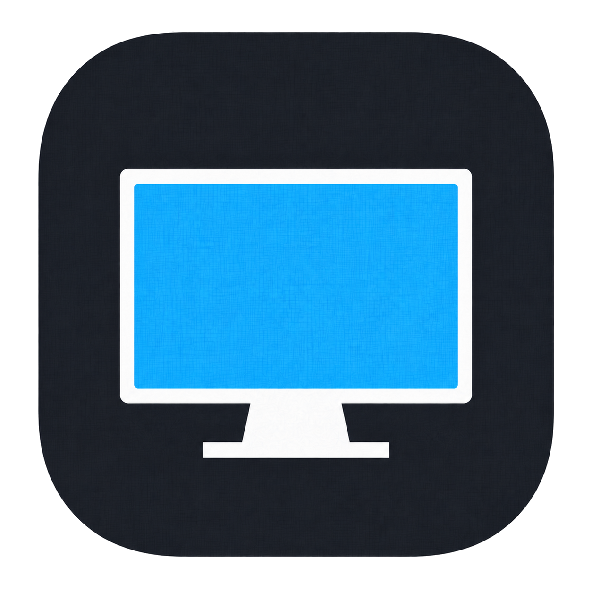

<div align="center">
  
  <h1>Monitorize</h1>
  <p><strong>Turn your Android tablet into a smooth, low-latency secondary monitor for Linux.</strong></p>

<a href="https://www.gnu.org/licenses/agpl-3.0"></a>


</div>

> **Project Status: In beta & Actively Being Developed**
> Core pipeline is fully functional on KDE and Hyprland. Sway support is available and GNOME support is experimental.

---

## Screenshots

<div align="center">
  
</div>

---

## 📖 Overview

**Monitorize** turns your Android tablet into a secondary monitor for your Linux desktop.

Supported desktop environments are KDE Plasma, Hyprland, and Sway. GNOME is experimental.

The pipeline is:

### ✨ What You Get

- A **High resolution** and **High FPS** second display.
- **USB Mode** for lowest latency and most stable quality
- **Wi-Fi Mode (Work In Progress)** for higher bitrates and multimonitor setups.
- **User friendly desktop app made with pyqt** to guide you through.
- **Android app** with a simple UI.

---

## 🛠️ Requirements

### 📦 Dependencies (Must Do)

> **Note:** Python packages (`PyQt6`, `evdev`, `zeroconf`) are automatically installed inside a virtual environment when you run `install.sh`. You only need to install the system-level packages listed below.

### Before running Monitorize, install the required packages for your distro and desktop environment. Follow your distro section below in order.

---

##  Fedora (DNF)

### Step 1 — Enable RPM Fusion

Fedora does not ship `x264enc` by default due to patent restrictions. Enable RPM Fusion first:

```bash
bash -c 'sudo dnf install -y https://download1.rpmfusion.org/free/fedora/rpmfusion-free-release-$(rpm -E %fedora).noarch.rpm https://download1.rpmfusion.org/nonfree/fedora/rpmfusion-nonfree-release-$(rpm -E %fedora).noarch.rpm'
```

### Step 2 — Install Core Dependencies (all DEs)

```bash
sudo dnf install -y --skip-unavailable \
  gstreamer1 \
  gstreamer1-plugins-base \
  gstreamer1-plugins-bad-free \
  gstreamer1-plugins-bad-freeworld \
  gstreamer1-plugins-ugly \
  gstreamer1-plugin-libav \
  pipewire \
  pipewire-gstreamer \
  python3-dbus \
  python3-gobject \
  android-tools
```

### Step 3 — Input Permission (all DEs)

Monitorize uses `/dev/uinput` for all Linux touch and stylus input. Enable uinput access before streaming:

```bash
echo 'KERNEL=="uinput", MODE="0660", GROUP="input"' | sudo tee /etc/udev/rules.d/99-uinput.rules
sudo udevadm control --reload-rules && sudo udevadm trigger
sudo usermod -aG input $USER
# Log out and back in for group change to take effect
```

### Step 4 — Desktop-Specific (Fedora)

### KDE Plasma:

KDE support requires Plasma 6.7+

```bash
sudo dnf install -y kscreen
```

### GNOME (Experimental):

No extra packages needed. However, you **must** disable hardware cursor rendering so the cursor is visible on the virtual monitor stream:

```bash
gsettings set org.gnome.mutter.wayland disable-hardware-cursor true
```

Log out and back in for the change to take effect. To revert:

```bash
gsettings set org.gnome.mutter.wayland disable-hardware-cursor false
```

### Hyprland:

Install the Hyprland XDG portal backend:

#### Step 1:

```bash
sudo dnf install -y \
  xdg-desktop-portal \
  xdg-desktop-portal-hyprland \
  xdg-desktop-portal-gtk \
  wlr-randr
```

### Sway:

Install the extra portal dependencies required by Monitorize:

```bash
sudo dnf install -y \
  xdg-desktop-portal \
  xdg-desktop-portal-wlr \
  xdg-desktop-portal-gtk
```

---

##  Arch Linux (Pacman)

### Step 1 — Install Core Dependencies (all DEs)

```bash
sudo pacman -S --needed \
  gstreamer \
  gst-plugins-base \
  gst-plugins-good \
  gst-plugins-bad \
  gst-plugins-ugly \
  gst-plugin-pipewire \
  pipewire \
  wireplumber \
  python-dbus \
  python-gobject \
  x264 \
  android-tools
```

### Step 2 — Input Permission (all DEs)

Monitorize uses `/dev/uinput` for all Linux touch and stylus input. Enable uinput access before streaming:

```bash
echo 'KERNEL=="uinput", MODE="0660", GROUP="input"' | sudo tee /etc/udev/rules.d/99-uinput.rules
sudo udevadm control --reload-rules && sudo udevadm trigger
sudo usermod -aG input $USER
# Log out and back in for group change to take effect
```

### Step 3 — Desktop-Specific (Arch)

### KDE Plasma:

KDE support requires Plasma 6.7+

```bash
sudo pacman -S --needed kscreen
```

### GNOME (Experimental):

No extra packages needed. However, you **must** disable hardware cursor rendering so the cursor is visible on the virtual monitor stream:

```bash
gsettings set org.gnome.mutter.wayland disable-hardware-cursor true
```

Log out and back in for the change to take effect. To revert:

```bash
gsettings set org.gnome.mutter.wayland disable-hardware-cursor false
```

### Hyprland:

#### Step 1 (specific dependencies)

```bash
sudo pacman -S --needed \
  xdg-desktop-portal \
  xdg-desktop-portal-hyprland \
  xdg-desktop-portal-gtk \
  wlr-randr
```

### Sway:

```bash
sudo pacman -S --needed \
  xdg-desktop-portal \
  xdg-desktop-portal-wlr \
  xdg-desktop-portal-gtk
```

##  Debian / Ubuntu (APT)

### Step 1 — Enable non-free repos (Debian only, skip on Ubuntu)

Debian restricts `gstreamer1.0-plugins-ugly` to the `non-free` component. Enable it first:

```bash
sudo apt install -y software-properties-common
sudo apt-add-repository non-free
sudo apt update
```

### Step 2 — Install Core Dependencies (all DEs)

```bash
sudo apt install -y \
  gstreamer1.0-tools \
  gstreamer1.0-plugins-base \
  gstreamer1.0-plugins-good \
  gstreamer1.0-plugins-bad \
  gstreamer1.0-plugins-ugly \
  gstreamer1.0-pipewire \
  gstreamer1.0-vaapi \
  intel-media-va-driver \
  mesa-va-drivers \
  pipewire \
  wireplumber \
  python3-dbus \
  python3-gi \
  adb \
  python3-pip \
  python3-venv \
  qt6-base-dev \
  libxkbcommon0 \
  psmisc \
  liboeffis1 \
  liboeffis-dev
```

### Step 3 — Input Permission (all DEs)

Monitorize uses `/dev/uinput` for all Linux touch and stylus input. Enable uinput access before streaming:

```bash
echo 'KERNEL=="uinput", MODE="0660", GROUP="input"' | sudo tee /etc/udev/rules.d/99-uinput.rules
sudo udevadm control --reload-rules && sudo udevadm trigger
sudo usermod -aG input $USER
# Log out and back in for group change to take effect
```

### Step 4 — Desktop-Specific (Debian / Ubuntu)

### KDE Plasma:

KDE support requires Plasma 6.7+

```bash
sudo apt install -y kscreen
```

### GNOME (Experimental):

No extra packages needed. However, you **must** disable hardware cursor rendering so the cursor is visible on the virtual monitor stream:

```bash
gsettings set org.gnome.mutter.wayland disable-hardware-cursor true
```

Log out and back in for the change to take effect. To revert:

```bash
gsettings set org.gnome.mutter.wayland disable-hardware-cursor false
```

### Hyprland:

#### Step 1:

```bash
sudo apt install -y \
  xdg-desktop-portal \
  xdg-desktop-portal-hyprland \
  xdg-desktop-portal-gtk \
  wlr-randr
```

> **Note:** `xdg-desktop-portal-hyprland` may not be in older Debian/Ubuntu repos. If not found, build from source: [xdg-desktop-portal-hyprland](https://github.com/hyprwm/xdg-desktop-portal-hyprland)

### Sway:

```bash
sudo apt install -y \
  xdg-desktop-portal \
  xdg-desktop-portal-wlr \
  xdg-desktop-portal-gtk
```

---

## Running the Application

1.After running the application make sure you go to your display settings and configure the virtual display.

2.When made changes to the virtual display's position or anything sometimes the stream crashes, it's normal just start the stream again (This won't work in gnome though).

### Notes

- Match the resolution and FPS set in the Android settings app to the desktop app settings.

- If the USB device is not detected, make sure `android-tools` is installed and run:
  
  ```bash
  adb devices
  ```
  
  to confirm the device is connected.

- Monitorize uses `/dev/uinput` for all Linux touch and stylus input on KDE, GNOME, Hyprland, and Sway. `Enable Stylus Features` exposes pressure, tilt, eraser, hover, and stylus buttons through the same uinput path. If uinput is unavailable, or the compositor cannot bind the device to the streamed output, input stops so it cannot target the wrong display.

- Stylus input suppresses finger touch for 5 seconds after the last stylus event. The `Disable Touch and Only Enable Stylus` option drops all finger-touch input while keeping stylus/eraser input active.

### Android Tablet

| Requirement       | Notes                              |
| ----------------- | ---------------------------------- |
| Android 9+        | Tested on Samsung Galaxy Tab S7 FE |
| USB Debugging     | Enable in Developer Options        |
| 5GHz Wi-Fi (opt.) | Recommended if using Wi-Fi mode    |

---

## 🚀 Getting Started

### 1. Clone and install (Desktop side)

```bash
git clone https://github.com/vinnavannewton/ProjectMonitorize.git
cd ProjectMonitorize/linux
chmod +x install.sh
./install.sh
```

Or run manually:

```bash
./venv/bin/python3 monitorize_gui.py
```

### 2. Android side

Either:

- Build from source:
  
  ```bash
  cd android
  ./gradlew installDebug
  adb shell am start -n com.example.monitorize/.MainActivity
  ```

Or:

- Install the APK from the Releases section.

---

## 🗺️ Roadmap

- [x] Stable CPU encoder (Software encoder).
- [x] Stable vaapi encoder
- [x] Fix stream corruption.
- [x] desktop GUI.
- [x] Touch screen.
- [ ] Stable nvidia encoder (waiting for driver 610.x which implemented proper DMA BUF).
- [ ] On Sway DE.
- [x] Stylus support with pressure, tilt, eraser, hover, and stylus buttons via uinput.
- [ ] Stable Wi-Fi mode (beta).
- [ ] Flathub distribution.
- [ ] use laptop as second screen.
- [ ] multi monitor setup.

---

## Star History

<a href="https://www.star-history.com/?type=date&repos=vinnavannewton%2FProjectMonitorize">
 <picture>
   <source media="(prefers-color-scheme: dark)" srcset="https://api.star-history.com/chart?repos=vinnavannewton/ProjectMonitorize&type=date&theme=dark&legend=top-left" />
   <source media="(prefers-color-scheme: light)" srcset="https://api.star-history.com/chart?repos=vinnavannewton/ProjectMonitorize&type=date&legend=top-left" />
   
 </picture>
</a>

<div align="center">
  <sub>Expanding your productivity, one monitor at a time.</sub>
</div>
