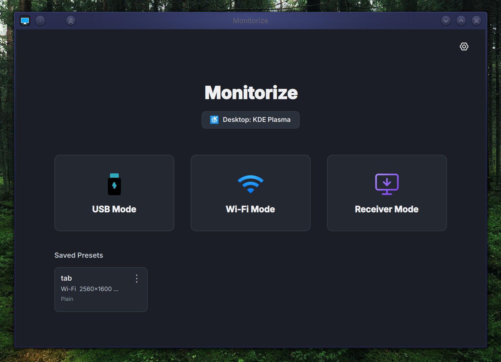
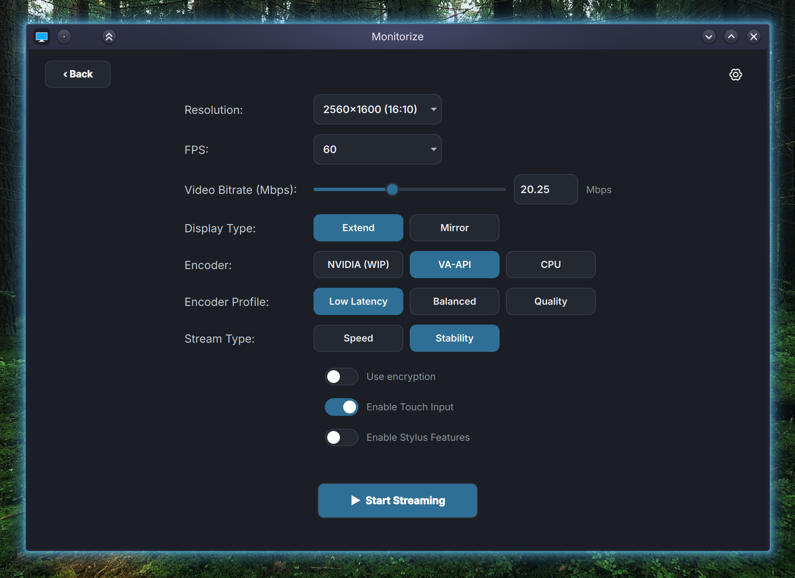

<div align="center">
  
  <h1>Monitorize</h1>
  <p><strong>Turn your Android, Linux laptop into a secondary monitor for your Linux desktop.</strong></p>

<a href="https://www.gnu.org/licenses/agpl-3.0"></a>


</div>

## Screenshots

<div align="center">
  
  <br />
  <br />
  
</div>

---

## 📖 Overview

**Monitorize** turns your Android tablet, Laptop, PC into a secondary monitor for your Linux desktop.

**Supported desktop environments are KDE Plasma, Hyprland and GNOME.**

---

## 🛠️ Requirements:

| Android               | Desktop                               |
| --------------------- | ------------------------------------- |
| Android 9+            | 🥇KDE (6.7+),🥇Hyprland,🥈GNOME (50+) |
| Wi-Fi / USB Debugging | Tested on: Arch, Fedora, NixOS.       |

---

## Installation:

### Desktop:

<table>
  <tr>
    <td><strong>Fedora</strong></td>
    <td><a href="https://github.com/vinnavannewton/project-monitorize/wiki/Fedora-installation">Fedora Installation</a></td>
  </tr>
  <tr>
    <td><strong>Arch Linux</strong></td>
    <td><a href="https://github.com/vinnavannewton/project-monitorize/wiki/Arch-installation">Arch Installation</a></td>
  </tr>
  <tr>
    <td><strong>Ubuntu / Debian</strong></td>
    <td><a href="https://github.com/vinnavannewton/project-monitorize/wiki/Ubuntu-Debian-installation">Ubuntu Debian Installation</a></td>
  </tr>
  <tr>
    <td><strong>NixOS / Nix</strong></td>
    <td><a href="https://github.com/vinnavannewton/project-monitorize/wiki/Nix-installation">Nix Installation</a></td>
  </tr>
</table>

### Android:

**Install the APK from Android [Releases](https://github.com/vinnavannewton/project-monitorize/releaseslatest).**

Or build from source:

```bash
cd android
./gradlew installDebug
adb shell am start -n com.example.monitorize/.MainActivity
```

---

## Running the Application:

1. After starting the stream in the desktop application make sure you go to your display settings and configure the newly created virtual display.

2. When made changes to the virtual display's position and applied, then the stream crashes, it's normal just restart the stream and the virtual monitor will spawn in the previous applied position.

### Notes:

- Match the resolution and FPS set in the Android app's settings to the desktop app settings.

---

## Contributing:

Please read the [Contribution Guide](https://github.com/vinnavannewton/project-monitorize/wiki/Contributing).

---

## 🗺️ Roadmap

- [x] Stable CPU encoder (Software encoder).

- [x] Stable vaapi encoder

- [x] Fix stream corruption.

- [x] desktop GUI.

- [x] Touch screen.

- [x] Stylus support with pressure.

- [x] Encrypted Wi-Fi mode.

- [x] Stable gnome.

- [x] Linux laptop as a viewer.

- [ ] Windows laptop as a viewer.

- [ ] Multi monitor setup.

- [x] NVIDIA NVENC with automatic DMA-BUF/GL, CUDA-upload, system-memory, and CPU fallback paths.

- [ ] AppImage.

---

## Star History

<a href="https://www.star-history.com/?type=timeline&repos=vinnavannewton%2Fproject-monitorize">
 <picture>
   <source media="(prefers-color-scheme: dark)" srcset="https://api.star-history.com/chart?repos=vinnavannewton/project-monitorize&type=timeline&theme=dark&legend=top-left&sealed_token=i7tImjFAdn6mJ7yyA6dCuwhVSy9r7uKrNKAkLLhC-1M3qLL9yJIwEQM0Fdf0M5QZGhCq_-7SEIzjL2sZDwbC0p39iYygcf1qunSnjYfURTQmwsVJGtyRRkZcv2apbaeXmn0rW6vGgif5DjDrhPsMAgM82DP2VRXDcxAkL2dDMvJj6fZocbabPGEMA_F6" />
   <source media="(prefers-color-scheme: light)" srcset="https://api.star-history.com/chart?repos=vinnavannewton/project-monitorize&type=timeline&legend=top-left&sealed_token=i7tImjFAdn6mJ7yyA6dCuwhVSy9r7uKrNKAkLLhC-1M3qLL9yJIwEQM0Fdf0M5QZGhCq_-7SEIzjL2sZDwbC0p39iYygcf1qunSnjYfURTQmwsVJGtyRRkZcv2apbaeXmn0rW6vGgif5DjDrhPsMAgM82DP2VRXDcxAkL2dDMvJj6fZocbabPGEMA_F6" />
   
 </picture>
</a>

<div align="center">
  <sub>Expanding your productivity, one monitor at a time.</sub>
</div>
