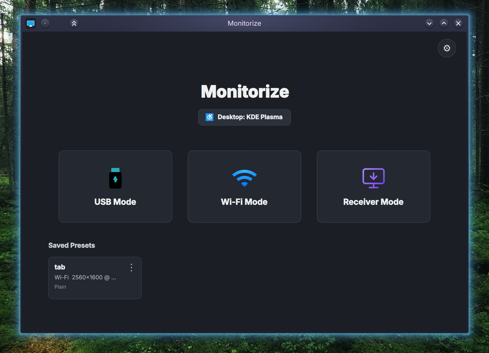

<div align="center">
  
  <h1>Monitorize</h1>
  <p><strong>Turn your Android, linux Laptop into a smooth, low-latency secondary monitor for your Linux Desktop .</strong></p>

<a href="https://www.gnu.org/licenses/agpl-3.0"></a>


</div>

## Screenshots

<div align="center">
  
</div>

---

## 📖 Overview

**Monitorize** turns your Android tablet, Laptop, PC into a secondary monitor for your Linux desktop.

Supported desktop environments are KDE Plasma, Hyprland and GNOME.

---

## 🛠️ Requirements:

| Android               | Desktop                           |
| --------------------- | --------------------------------- |
| Android 9+            | 🥇KDE (6.7+),🥇Hyprland,🥈GNOME (50+) |
| Wi-Fi / USB Debugging | Tested on: Arch, fedora.          |

---

## Installing dependencies:

Choose your distro.

<table>
  <tr>
    <td><strong>Fedora</strong></td>
    <td><a href="https://github.com/vinnavannewton/project-monitorize/wiki/Fedora-installation">Fedora Installation</a></td>
  </tr>
  <tr>
    <td><strong>Arch Linux</strong></td>
    <td><a href="https://github.com/vinnavannewton/project-monitorize/wiki/Arch-installation">Arch Installation</a></td>
  </tr>
  <tr>
    <td><strong>Ubuntu / Debian</strong></td>
    <td><a href="https://github.com/vinnavannewton/project-monitorize/wiki/Ubuntu-Debian-installation">Ubuntu Debian Installation</a></td>
  </tr>
</table>

After installing the required dependencies, continue with the steps below.

---

## 🚀 Installation

### 1. Desktop app:

```bash
git clone https://github.com/vinnavannewton/ProjectMonitorize.git
cd ProjectMonitorize/linux
cd scripts
chmod +x install.sh
./install.sh
```

Or run manually:

```bash
./venv/bin/python3 -m monitorize
```

### 2. Android app:

- Install the APK from the [Releases](https://github.com/vinnavannewton/project-monitorize/releases/latest) section.
  
Or build from source:
  
  ```bash
  cd android
  ./gradlew installDebug
  adb shell am start -n com.example.monitorize/.MainActivity
  ```

---

##  NixOS / Nix (Flake)

A Nix flake is included — all dependencies are handled automatically.

### Try without installing:

```bash
nix run github:vinnavannewton/ProjectMonitorize
```

### Install on NixOS (declarative):

Add the flake to your system configuration:

```nix
# flake.nix
{
  inputs.monitorize.url = "github:vinnavannewton/ProjectMonitorize";

  outputs = { nixpkgs, monitorize, ... }: {
    nixosConfigurations.myhost = nixpkgs.lib.nixosSystem {
      modules = [
        monitorize.nixosModules.default
        { programs.monitorize.enable = true; }
      ];
    };
  };
}
```

This installs the app, creates a dedicated `monitorize-input` group for uinput access, and makes it available in your application menu.

> **Grant uinput access** — add your user to the `monitorize-input` group in your NixOS config:
> ```nix
> users.users.<yourname>.extraGroups = [ "monitorize-input" ];
> ```

### Install imperatively (any distro with Nix):

```bash
nix profile install github:vinnavannewton/ProjectMonitorize
```

### Desktop-Specific (NixOS):

KDE Plasma and Hyprland tools (`kscreen-doctor`, `wlr-randr`) are bundled in the package wrapper — no extra packages needed.

For **GNOME**, add to your NixOS config:

```nix
environment.variables.MUTTER_DEBUG_DISABLE_HW_CURSORS = "1";
```

---

## Running the Application:

1.After starting the stream in the desktop application make sure you go to your display settings and configure the newly created virtual display.

2.When made changes to the virtual display's position and applied, then the stream crashes, it's normal just restart the stream and the virtual monitor will spawn in the previous applied position.

---

### Notes:

- Match the resolution and FPS set in the Android app's settings to the desktop app settings.

---

## Contributing:

Please read the [Contribution Guide](https://github.com/vinnavannewton/project-monitorize/wiki/Contributing).

---

## 🗺️ Roadmap

- [x] Stable CPU encoder (Software encoder).

- [x] Stable vaapi encoder

- [x] Fix stream corruption.

- [x] desktop GUI.

- [x] Touch screen.

- [x] Stylus support with pressure.

- [x] Encrypted Wi-Fi mode.

- [x] Stable gnome.

- [x] Laptop as a viewer.

- [ ] Multi monitor setup.

- [ ] Stable nvidia encoder (waiting for driver 610.x which implemented proper DMA BUF).

- [ ] AppImage.

---

Star History

<a href="https://www.star-history.com/#vinnavannewton/project-monitorize&Date">
 <picture>
   <source media="(prefers-color-scheme: dark)" srcset="https://api.star-history.com/chart?repos=vinnavannewton/project-monitorize&type=date&theme=dark&legend=top-left&cache=20260704" />
   <source media="(prefers-color-scheme: light)" srcset="https://api.star-history.com/chart?repos=vinnavannewton/project-monitorize&type=date&legend=top-left&cache=20260704" />
   
 </picture>
</a>

<div align="center">
  <sub>Expanding your productivity, one monitor at a time.</sub>
</div>
