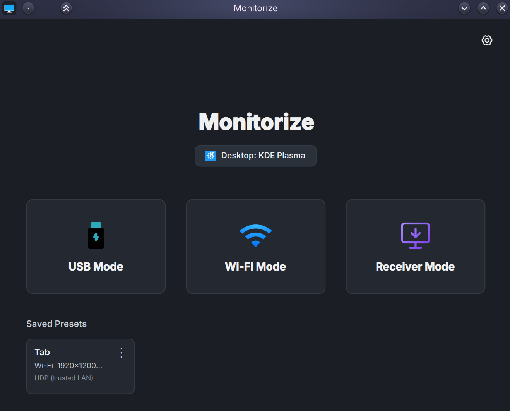
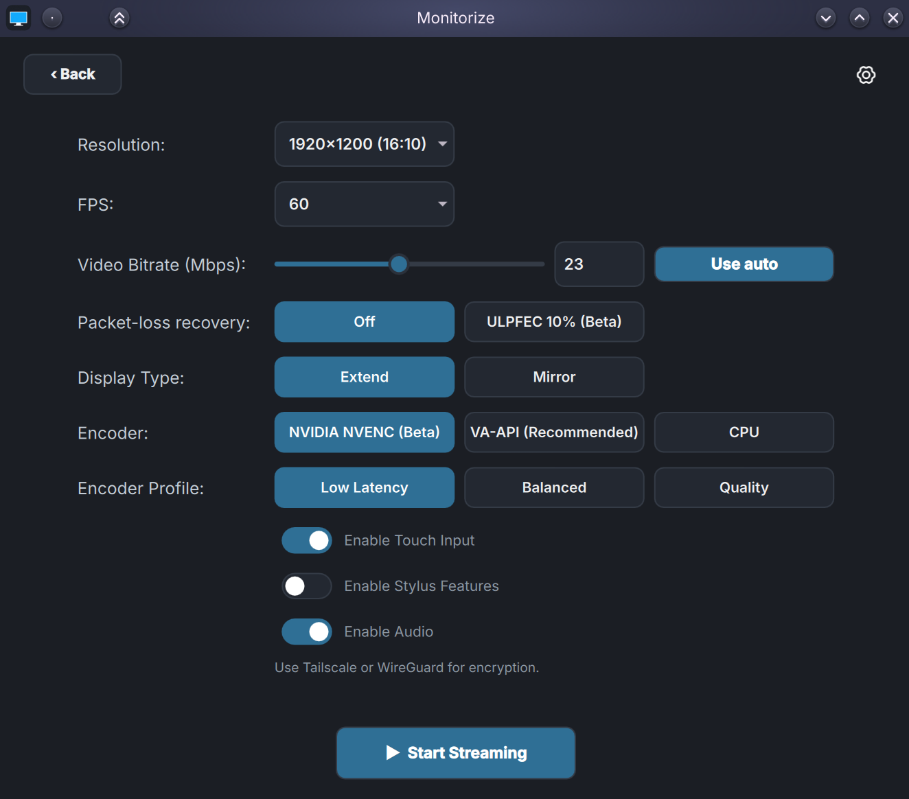

<div align="center">
  
  <h1>Monitorize</h1>
  <p><strong>Turn your Android, Linux laptop into a secondary monitor for your Linux desktop.</strong></p>

<a href="https://www.gnu.org/licenses/gpl-3.0"></a>


</div>

## Screenshots

<div align="center">
  
  <br />
  <br />
  
</div>

---

## 📖 Overview

**Monitorize** turns your Android tablet, PC into a secondary monitor for your Linux desktop.

**Supported desktop environments are KDE Plasma, Hyprland and GNOME.**

---

## 🛠️ Requirements:

| Android               | Desktop                               |
| --------------------- | ------------------------------------- |
| Android 9+            | 🥇KDE (6.7+),🥇Hyprland,🥈GNOME (50+) |
| Wi-Fi / USB Debugging | Tested on: Arch, Fedora, NixOS.       |

---

## Installation:

### Desktop:

<table>
  <tr>
    <td><strong>Fedora</strong></td>
    <td><a href="https://github.com/vinnavannewton/project-monitorize/wiki/Fedora-installation">Fedora Installation</a></td>
  </tr>
  <tr>
    <td><strong>Arch Linux</strong></td>
    <td><a href="https://github.com/vinnavannewton/project-monitorize/wiki/Arch-installation">Arch Installation</a></td>
  </tr>
  <tr>
    <td><strong>Ubuntu / Debian</strong></td>
    <td><a href="https://github.com/vinnavannewton/project-monitorize/wiki/Ubuntu-Debian-installation">Ubuntu Debian Installation</a></td>
  </tr>
  <tr>
    <td><strong>NixOS / Nix</strong></td>
    <td><a href="https://github.com/vinnavannewton/project-monitorize/wiki/Nix-installation">Nix Installation</a></td>
  </tr>
</table>

### Android:

**Install the APK from Android [Releases](https://github.com/vinnavannewton/project-monitorize/releaseslatest).**

Or build from source:

```bash
cd android
./gradlew installDebug
adb shell am start -n com.example.monitorize/.MainActivity
```

---

## Running the Application:

1. After starting the stream in the desktop application make sure you go to your display settings and configure the newly created virtual display.

2. When made changes to the virtual display's position, it might stop working, it's normal just restart the stream and the virtual monitor will spawn in the position it was set to.

---

## Contributing:

Please read the [Contribution Guide](https://github.com/vinnavannewton/project-monitorize/wiki/Contributing).

---

## Star History


---

## Support Monitorize

<div align="center">
  <a href="https://ko-fi.com/vinnavan">
    
  </a>
</div>

---

<div align="center">
  <sub>Expanding your productivity, one monitor at a time.</sub>
</div>
