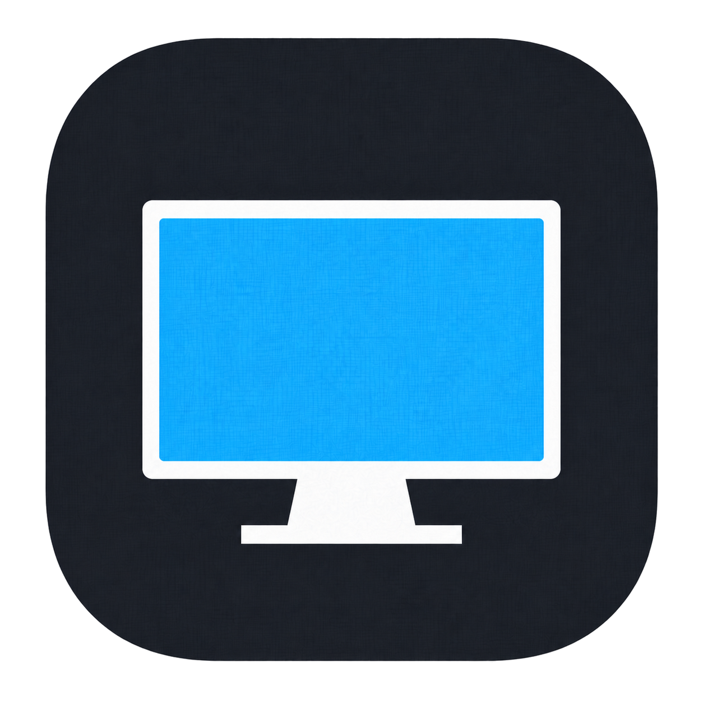

<div align="center">
  
  <h1>Monitorize</h1>
  <p><strong>Create Sunshine-backed virtual displays and use them from any Moonlight client.</strong></p>
</div>

Monitorize is a Linux host application for KDE Plasma, GNOME, and Hyprland. It creates and preserves compositor-native virtual displays, configures an isolated bundled Sunshine server for each display, and keeps the complete session alive until you stop it.

Receiving is handled by the standard [Moonlight](https://moonlight-stream.org/) application on Android, Linux, Windows, macOS, iOS, and other supported clients. Monitorize no longer ships a receiver, USB/ADB transport, or its former GStreamer streaming backend.

## Features

- Extend or mirror a Linux desktop.
- One or two isolated Sunshine instances.
- Moonlight PIN pairing from the Monitorize window.
- Sunshine encoder, codec, audio, touch, and stylus configuration.
- KDE, GNOME, and Hyprland virtual-display lifecycle management.
- Saved Sunshine display presets.
- Project-local Sunshine installation without modifying `/usr/local`.

## Supported desktops

- KDE Plasma 6.7+
- GNOME 50+
- Supported Hyprland releases

The dependency flow supports Ubuntu 24.04 and Debian 13, but their default desktop versions may be older than the versions above.

## Installation

- [Fedora](https://github.com/vinnavannewton/project-monitorize/wiki/Fedora-installation)
- [Arch Linux](https://github.com/vinnavannewton/project-monitorize/wiki/Arch-installation)
- [Ubuntu / Debian](https://github.com/vinnavannewton/project-monitorize/wiki/Ubuntu-Debian-installation)
- [openSUSE Tumbleweed (experimental)](https://github.com/vinnavannewton/project-monitorize/wiki/openSUSE-Tumbleweed-installation)
- [NixOS / Nix](https://github.com/vinnavannewton/project-monitorize/wiki/Nix-installation)

Source installation uses the repository and all submodules:

```bash
git clone --recurse-submodules https://github.com/vinnavannewton/project-monitorize.git
cd project-monitorize
git submodule update --init --recursive
cd linux/scripts
chmod +x install.sh
./install.sh
```

Keep the clone in place after installing. The desktop entry and bundled Sunshine installation use files inside that checkout.

## Usage

1. Open Monitorize and choose **Create a Virtual Display**.
2. Select resolution, refresh rate, Extend or Mirror, and Sunshine options.
3. Start the display.
4. Open Moonlight on the receiving device and select the advertised host.
5. Enter Moonlight's four-digit PIN in Monitorize when pairing.

Sunshine instance 1 uses base port `47989`. An optional second display uses base port `49089`.

## Development checks

```bash
cd linux
./venv/bin/python3 -m unittest discover -s tests
./venv/bin/python3 -m compileall monitorize tests
bash -n scripts/install.sh
```

Monitorize is licensed under GPL-3.0-only.
