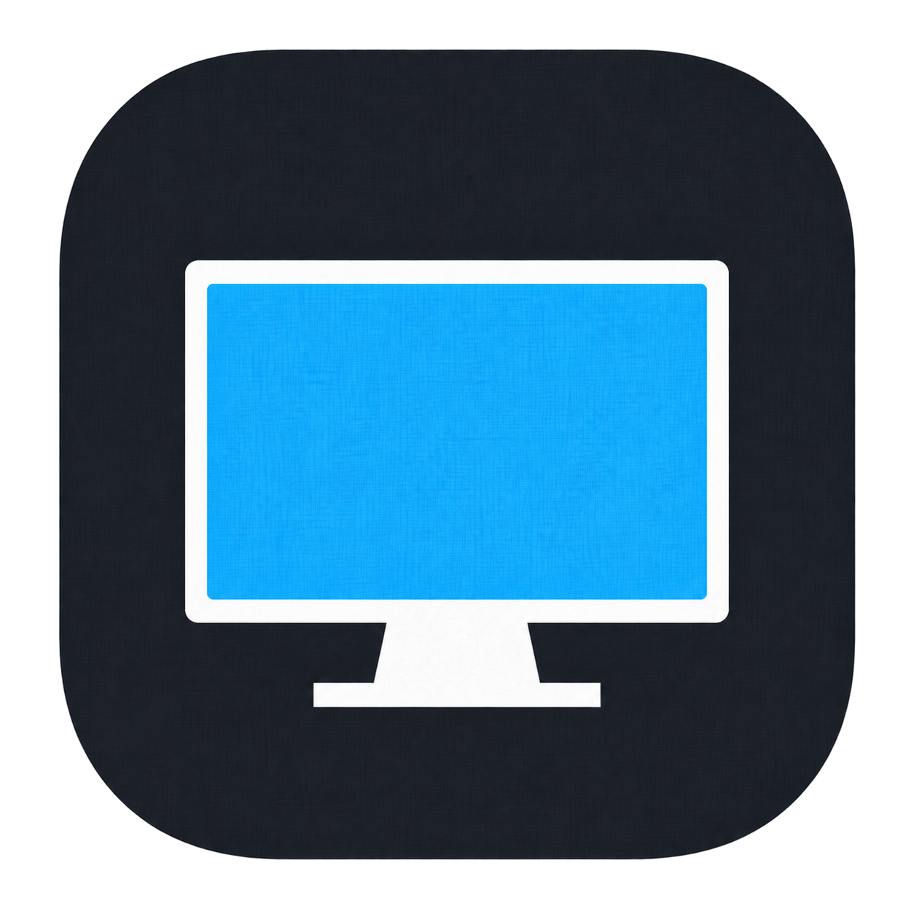
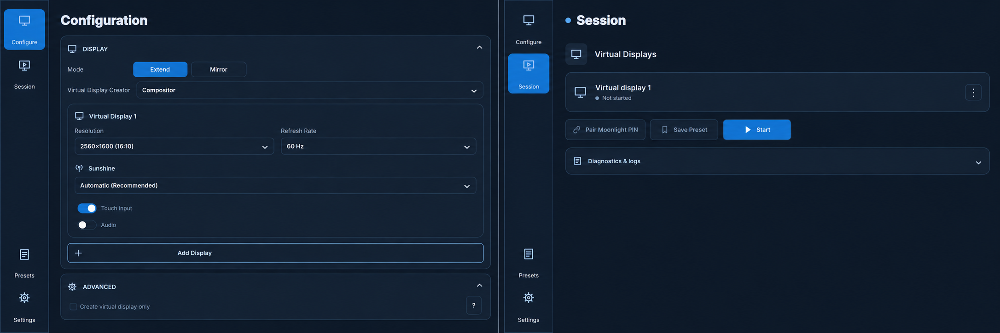

  
  <h1>Monitorize</h1>
  
<strong>A virtual display manager for Linux with built-in streaming.</strong>

  

    
    
    
    
  

https://github.com/user-attachments/assets/14a21a68-011b-43bf-9f26-fc9ea731d80b

Monitorize creates and manages virtual displays on Linux using compositor-native outputs or [monitorize-vkms](https://github.com/vinnavannewton/monitorize-vkms). Use virtual displays on their own, or stream them to another device through built-in Sunshine integration.

For streaming, connect with [Moonlight](https://moonlight-stream.org/) on Android, Linux, Windows, macOS, iOS, or another supported device.

## Features

- Create and manage up to two virtual displays.

- Support compositor-native virtual displays and monitorize-vkms.

- Stream virtual displays or mirror an existing monitor through Sunshine.

- Configure streaming encoders, codecs, audio, touch, and stylus options via the integrated sunshine.

- Keeps Monitorize's Sunshine instances separate from your existing Sunshine setup.

## Supported desktops

This table shows whether each desktop environment supports via compositor-native virtual displays, [monitorize-vkms](https://github.com/vinnavannewton/monitorize-vkms), or both.
| Desktop Environment | Compositor | monitorize-vkms |
| --- | :---: | :---: |
| KDE Plasma 6.7+ | ✅ | ✅ |
| GNOME 50+| ✅ | ✅ |
| Hyprland | ✅ | ❌ |
| Niri | ❌ | ✅ |
| Cinnamon X11 | ❌ | ✅ |

## Installation

- [Fedora](https://github.com/vinnavannewton/project-monitorize/wiki/Fedora-installation)
- [Arch Linux](https://github.com/vinnavannewton/project-monitorize/wiki/Arch-installation)
- [Ubuntu](https://github.com/vinnavannewton/project-monitorize/wiki/Ubuntu-installation)
- [openSUSE Tumbleweed](https://github.com/vinnavannewton/project-monitorize/wiki/openSUSE-Tumbleweed-installation)
- [NixOS / Nix](https://github.com/vinnavannewton/project-monitorize/wiki/Nix-installation)

## Contributing

Want to contribute? See the [Contributing guide](https://github.com/vinnavannewton/project-monitorize/wiki/Contributing).

## Usage

For DE's with no compositor-native virtual display support, use via VKMS by installing [monitorize-vkms](https://github.com/vinnavannewton/monitorize-vkms).

Tip: If the stream is black or crashes, try changing the stream from auto to other options in monitorize based on what your hardware supports.

## Star History

<a href="https://www.star-history.com/?repos=vinnavannewton%2FProjectMonitorize&type=date&legend=top-left">
 <picture>
   <source media="(prefers-color-scheme: dark)" srcset="https://api.star-history.com/chart?repos=vinnavannewton/ProjectMonitorize&type=date&theme=dark&legend=top-left&sealed_token=UrJIpYgjHe4fJj10B7GKSJo0AdhR5bGEFiNv9cpP4iJQEhNXknPXAq5aX7g6bk2y7UAMoa3xfVqKyRWSANVZobe2uVlMjvYXbCaeOmO5w6tdzEvCjnFejmzXxjtW2mIf4Yny6uOhs2jXSxC01ZMh5Q_Dd6dRD2NniWjkaltRE1SzVWfwyOP0rZwE5oCI" />
   <source media="(prefers-color-scheme: light)" srcset="https://api.star-history.com/chart?repos=vinnavannewton/ProjectMonitorize&type=date&legend=top-left&sealed_token=UrJIpYgjHe4fJj10B7GKSJo0AdhR5bGEFiNv9cpP4iJQEhNXknPXAq5aX7g6bk2y7UAMoa3xfVqKyRWSANVZobe2uVlMjvYXbCaeOmO5w6tdzEvCjnFejmzXxjtW2mIf4Yny6uOhs2jXSxC01ZMh5Q_Dd6dRD2NniWjkaltRE1SzVWfwyOP0rZwE5oCI" />
   
 </picture>
</a>
